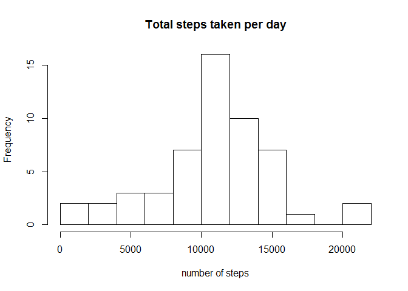
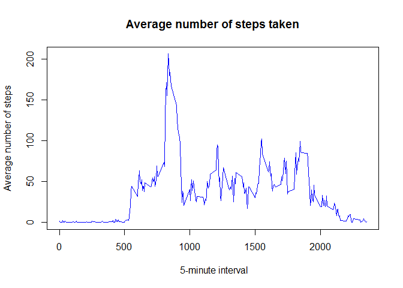
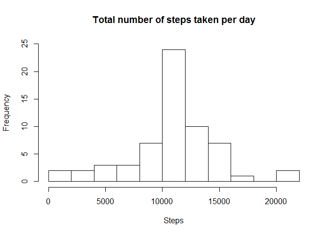
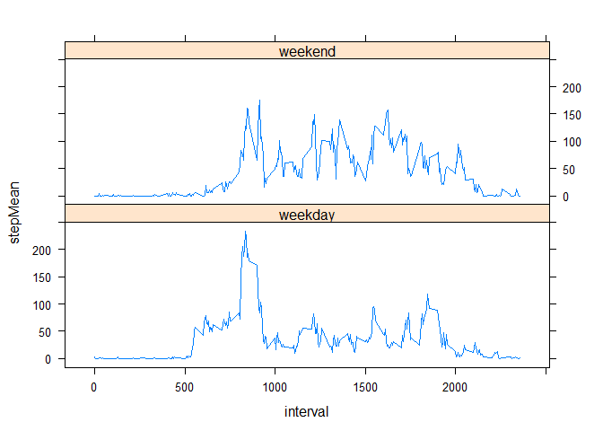

# Reproducible Research - Peer Assessment 1
August 17, 2015  


## Loading and preprocessing the data
1. Load the data


```r
if(!file.exists('activity.csv')){
    unzip('activity.zip')
}
data <- read.csv('activity.csv')
```
2. Convert date to date data type


```r
data$date <- as.Date(data$date) 
```

## What is mean total number of steps taken per day?
1. Calculate the total number of steps taken per day

```r
totalStepsPerDay <- aggregate(steps ~ date, data = data, sum, na.rm = TRUE)
```
2. Make a histogram of the total number of steps taken each day

```r
hist(totalStepsPerDay$steps, main = "Total steps taken per day", xlab = "number of steps", breaks=13)
```

 
  
3. Calculate and report the mean and median of the total number of steps taken per day

```r
meanStepsPerDay <- mean(totalStepsPerDay$steps)
meanStepsPerDay
```

```
## [1] 10766.19
```

```r
medianStepsPerDay <- median(totalStepsPerDay$steps)
medianStepsPerDay
```

```
## [1] 10765
```


## What is the average daily activity pattern?

1. Calculate average steps for each of 5-minute interval during a 24-hour period


```r
interval.mean.steps <- aggregate(steps ~ interval, data = data, mean, na.rm = TRUE)
```
2. Make a time series plot of the 5-minute interval


```r
plot(interval.mean.steps$interval, interval.mean.steps$steps, type = "l", col="blue", 
     main="Average number of steps taken", xlab=" 5-minute interval", 
     ylab="Average number of steps")
```

 


2. Which 5-minute interval, on average across all the days in the dataset, contains the maximum number of steps?

```r
interval.mean.steps[interval.mean.steps$steps == max(interval.mean.steps$steps), ]
```

```
##     interval    steps
## 104      835 206.1698
```

## Imputing missing values

1. Calculate and report the total number of missing values in the dataset

```r
numMissingValues <- length(which(is.na(data$steps)))
```

2. Devise a strategy for filling in all of the missing values in the dataset.

To fill the missing values in the dataset, here I use the mean for that 5-minute interval

3. Create a new dataset that is equal to the original dataset but with the missing data filled in.

```r
library(Hmisc)
```

```
## Loading required package: grid
## Loading required package: lattice
## Loading required package: survival
## Loading required package: Formula
## Loading required package: ggplot2
## 
## Attaching package: 'Hmisc'
## 
## The following objects are masked from 'package:base':
## 
##     format.pval, round.POSIXt, trunc.POSIXt, units
```

```r
dataImputed <- data
dataImputed$steps <- impute(data$steps, fun=mean)
```
4. Make a histogram of the total number of steps taken each day

```r
stepsByDayImputed <- tapply(dataImputed$steps, dataImputed$date, sum)

hist(stepsByDayImputed, main = "Total number of steps taken per day", xlab = "Steps", ylim =c(0, 25),breaks=13)
```

 

5. Calculate and report the mean and median of the total number of steps taken per day from imputed data

```r
meanStepsPerDayImputed <- mean(stepsByDayImputed)
meanStepsPerDayImputed
```

```
## [1] 10766.19
```

```r
medianStepsPerDayImputed <- median(stepsByDayImputed)
medianStepsPerDayImputed
```

```
## [1] 10766.19
```

## Are there differences in activity patterns between weekdays and weekends?
1.Create a new factor variable in the dataset with two levels - "weekday" and "weekend" indicating whether a given date is a weekday or weekend day.


```r
wd <- weekdays (data$date)
data$dateType <- factor (wd, levels <- c ('weekday', 'weekend'))
data$dateType[] <- 'weekday'
data$dateType[wd %in% c ('Saturday', 'Sunday')] <- 'weekend'
```

2. Make a panel plot containing a time series plot


```r
library(plyr)
```

```
## 
## Attaching package: 'plyr'
## 
## The following objects are masked from 'package:Hmisc':
## 
##     is.discrete, summarize
```

```r
dataImputed <- ddply (data,  .(interval, dateType), summarize, 
              stepMean = mean(steps, na.rm=TRUE))

xyplot(stepMean ~ interval | dateType, 
        data=dataImputed,
        type='l', layout=c (1, 2))
```

 
